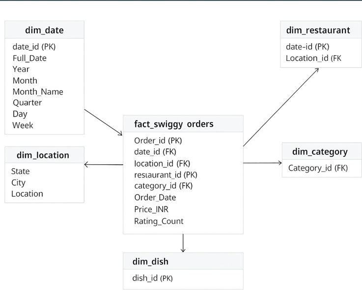

# 🍽️ Swiggy Sales Analysis using SQL


---

# 📌 Project Overview

This project demonstrates a complete **SQL Data Analytics Pipeline** using a Swiggy food delivery dataset.

The objective is to transform raw transactional food delivery data into a structured analytical database capable of answering real business questions through SQL.

The project follows an industry-standard workflow consisting of:

- Business Requirement Analysis
- Data Cleaning & Validation
- Data Warehouse Design
- Star Schema Modelling
- Dimension & Fact Table Creation
- Business KPI Development
- Exploratory Data Analysis using SQL

Instead of running SQL queries directly on a single raw table, the project first converts the data into a **Star Schema**, making analytical queries faster, cleaner, and easier to maintain.

---

# 🎯 Business Problem

Food delivery platforms generate millions of transactions every day.

Business teams require reliable analytics to answer questions such as:

- Which cities generate the highest revenue?
- Which restaurants receive the highest number of orders?
- Which food categories are most popular?
- How are sales changing month over month?
- Which dishes are ordered most frequently?
- What is the average customer spending?
- How are customer ratings distributed?

This project solves these business questions using SQL.

---

# 🏗️ Project Architecture

```
                 Raw Dataset
                      │
                      ▼
        Data Cleaning & Validation
                      │
                      ▼
            Star Schema Modelling
                      │
                      ▼
      Dimension & Fact Table Creation
                      │
                      ▼
         Business KPI Development
                      │
                      ▼
            SQL Business Analysis
```

---

# 🛠️ Tech Stack

| Technology | Purpose |
|------------|---------|
| SQL Server | Database |
| SQL | Data Analysis |
| Star Schema | Data Warehouse Design |
| SSMS | Query Execution |
| ERD | Database Design |
| Git | Version Control |
| GitHub | Project Hosting |

---

# 📂 Dataset

The dataset contains food delivery transactions collected from multiple restaurants across India.

Each record contains information including:

- Order ID
- Order Date
- State
- City
- Restaurant
- Location
- Category
- Dish Name
- Price
- Rating
- Rating Count

---

# 📁 Repository Structure

```
Swiggy-Sales-Analysis/

│
├── Dataset/
│      Swiggy_Data.csv
│
├── SQL Scripts/
│      01_Data_Cleaning_and_Validation.sql
│      02_Data_Modelling_Star_Schema.sql
│      03_Data_Analysis.sql
│
├── Documents/
│      Business_Requirements.pdf
│      SQL_Analysis_Document.pdf
│
├── Images/
│      ERD.png
│
├── README.md
│
└── LICENSE
```

---

# 🚀 Project Workflow

## 1️⃣ Business Requirement Gathering

Before writing SQL queries, business requirements were identified to understand what insights stakeholders expected from the data.

Requirements included:

- Revenue Analysis
- Order Trends
- Restaurant Performance
- Cuisine Performance
- Customer Spending
- Ratings Analysis
- City-wise Performance

---

## 2️⃣ Data Cleaning & Validation

The raw dataset contained inconsistencies that needed to be cleaned before analysis.

Performed:

✔ Null Value Detection

- State
- City
- Restaurant
- Order Date
- Category
- Dish Name
- Price
- Rating
- Rating Count

✔ Blank Value Detection

Detected empty string values.

✔ Duplicate Detection

Used GROUP BY to identify duplicate records.

✔ Duplicate Removal

Used

```sql
ROW_NUMBER()
```

to remove duplicate rows while preserving one original record.

---

## 3️⃣ Data Warehouse Design

Instead of querying one large table, the dataset was converted into a **Star Schema**.

### Dimension Tables

- dim_date
- dim_location
- dim_restaurant
- dim_category
- dim_dish

### Fact Table

fact_swiggy_orders

The fact table stores measurable business values while dimensions contain descriptive attributes.

This improves:

- Query Performance
- Readability
- Scalability
- Dashboard Integration

---

# ⭐ Star Schema

> Replace the image path below with your uploaded ERD.

```markdown

```

---

# 📊 Business KPIs

The following KPIs were developed.

### Revenue KPIs

- Total Orders
- Total Revenue
- Average Dish Price
- Average Rating

---

# 📈 Business Analysis

## 📅 Date Analysis

- Monthly Order Trends
- Quarterly Revenue
- Yearly Growth
- Day of Week Analysis

---

## 🌍 Location Analysis

- Top 10 Cities by Orders
- Top 10 Cities by Revenue
- Revenue Contribution by State

---

## 🍽 Restaurant Analysis

- Top Restaurants by Orders
- Most Popular Categories
- Most Ordered Dishes
- Cuisine Performance

---

## 💰 Customer Spending Analysis

Customer spending buckets:

- Under ₹100
- ₹100–199
- ₹200–299
- ₹300–499
- ₹500+

---

## ⭐ Ratings Analysis

Distribution of ratings from

- 1 Star
- 2 Star
- 3 Star
- 4 Star
- 5 Star

---

# 📌 SQL Concepts Used

This project demonstrates practical use of:

- SELECT
- WHERE
- ORDER BY
- GROUP BY
- HAVING
- CASE WHEN
- Aggregate Functions
- INNER JOIN
- Common Table Expressions (CTE)
- Window Functions
- ROW_NUMBER()
- DATE Functions
- String Functions
- Data Type Conversion
- Ranking Queries

---

# 💡 Business Insights Generated

The project helps stakeholders answer questions like:

✔ Which city generates maximum revenue?

✔ Which restaurant receives the highest number of orders?

✔ Which cuisines are most preferred?

✔ Which dishes are most popular?

✔ Which price range contributes the highest order volume?

✔ Which day receives the highest number of orders?

✔ What is the overall customer satisfaction?

---

# 📚 Skills Demonstrated

- SQL Programming
- Data Cleaning
- Data Validation
- Data Warehouse Design
- Star Schema Modelling
- Data Analysis
- Business Intelligence
- Database Design
- Query Optimization
- Analytical Thinking

---

# 📸 Sample Outputs

You can add screenshots like:

- KPI Results
- Monthly Trend Output
- Top Restaurants
- Revenue Analysis
- SQL Query Results

Example:

```
Images/
    KPI_TotalRevenue.png
    MonthlyTrend.png
    TopCities.png
    TopRestaurants.png
```

---

# 🎯 Future Improvements

This project can be extended by:

- Building an interactive Power BI Dashboard
- Creating SQL Stored Procedures
- Implementing Views
- Creating Indexes for Performance Optimization
- Automating ETL using SSIS
- Migrating to Azure SQL Database

---

# 📖 Learning Outcomes

Through this project I learned:

- Designing a Star Schema
- Building Fact & Dimension Tables
- Cleaning raw datasets
- Performing business-driven SQL analysis
- Writing optimized SQL queries
- Developing KPIs
- Transforming raw data into actionable business insights

---

# 👨‍💻 Author

**Gaurav Mali**

B.Tech Bioengineering | Aspiring Data Analyst

### Connect with me

- LinkedIn: https://linkedin.com/in/YOUR_LINK
- GitHub: https://github.com/YOUR_USERNAME

---

# ⭐ If you found this project useful, don't forget to give it a Star!
